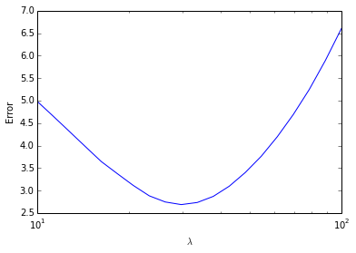
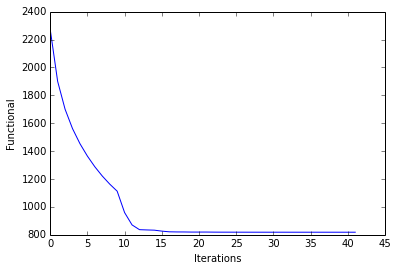
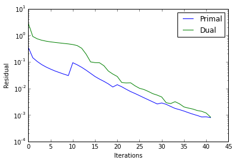
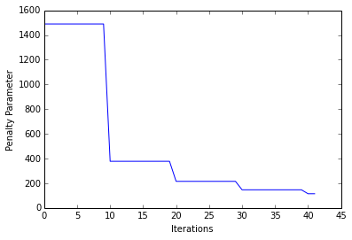

Solving the BPDN problem using SPORCO
=====================================

This notebook demonstrates the use of SPORCO to solve the Basis Pursuit
DeNoising (BPDN) problem

.. math:: \mathrm{argmin}_\mathbf{x} \; (1/2) \| D \mathbf{x} - \mathbf{s} \|_2^2 + \lambda \| \mathbf{x} \|_1

where :math:`D` is the dictionary, :math:`\mathbf{x}` is the sparse
representation, and :math:`\mathbf{s}` is the signal to be represented.
In this example (based on the ``demo_bpdn.py`` example script) the BPDN
problem is used to estimate the reference sparse representation that
generated a signal from a noisy version of the signal.

Import modules and configure matplotlib output to notebook.

.. code:: ipython3

    from __future__ import print_function
    from builtins import input
    from builtins import range
    
    import numpy as np
    
    from sporco import util
    from sporco import plot
    from sporco.admm import bpdn
    
    %matplotlib inline

Configure problem size, sparsity, and noise level.

.. code:: ipython3

    # Signal and dictionary size
    N = 512
    M = 4*N
    # Number of non-zero coefficients in generator
    L = 32
    # Noise level
    sigma = 0.5

Construct random dictionary, reference random sparse representation, and
test signal consisting of the synthesis of the reference sparse
representation with additive Gaussian noise.

.. code:: ipython3

    # Construct random dictionary and random sparse coefficients
    np.random.seed(12345)
    D = np.random.randn(N, M)
    x0 = np.zeros((M, 1))
    si = np.random.permutation(list(range(0, M-1)))
    x0[si[0:L]] = np.random.randn(L, 1)
    
    # Construct reference and noisy signal
    s0 = D.dot(x0)
    s = s0 + sigma*np.random.randn(N,1)

Set BPDN solver class options.

.. code:: ipython3

    # Set BPDN options
    opt = bpdn.BPDN.Options({'Verbose' : False, 'MaxMainIter' : 500,
                        'RelStopTol' : 1e-3, 'AutoRho' : {'RsdlTarget' : 1.0}})

Select regularization parameter :math:`\lambda` by evaluating the error
in recovering the sparse representation over a logarithmicaly spaced
grid. (The reference representation is assumed to be known, which is not
realistic in a real application.) A function is defined that evalues the
BPDN recovery error for a specified :math:`\lambda`, and this function
is evaluated in parallel by ``sporco.util.grid_search``.

.. code:: ipython3

    # Function computing reconstruction error at lmbda
    def evalerr(prm):
        lmbda = prm[0]
        b = bpdn.BPDN(D, s, lmbda, opt)
        x = b.solve()
        return np.sum(np.abs(x-x0))
    
    
    # Parallel evalution of error function on lmbda grid
    lrng = np.logspace(1, 2, 20)
    sprm, sfvl, fvmx, sidx = util.grid_search(evalerr, (lrng,))
    lmbda = sprm[0]
    
    print('Minimum ℓ1 error: %5.2f at 𝜆 = %.2e' % (sfvl, lmbda))

.. parsed-literal::

    Minimum ℓ1 error:  2.69 at 𝜆 = 2.98e+01

Plot recovery error against :math:`\lambda`.

.. code:: ipython3

    plot.plot(fvmx, x=lrng, ptyp='semilogx', xlbl='$\lambda$',
              ylbl='Error')
    plot.close()

Once the best :math:`\lambda` has been determined, run BPDN with verbose
display of ADMM iteration statistics.

.. code:: ipython3

    # Initialise and run BPDN object for best lmbda
    opt['Verbose'] = True
    b = bpdn.BPDN(D, s, lmbda, opt)
    b.solve()
    
    print("BPDN solve time: %.2fs" % b.runtime)

.. parsed-literal::

    Itn   Fnc       DFid      Regℓ1     r         s         ρ         
    ----------------------------------------------------------------
       0  2.27e+03  4.58e+02  6.10e+01  3.47e-01  2.80e+00  1.49e+03
       1  1.90e+03  2.86e+02  5.42e+01  1.42e-01  8.98e-01  1.49e+03
       2  1.70e+03  2.51e+02  4.87e+01  1.03e-01  7.33e-01  1.49e+03
       3  1.56e+03  2.21e+02  4.50e+01  7.85e-02  6.49e-01  1.49e+03
       4  1.45e+03  2.04e+02  4.20e+01  6.34e-02  5.98e-01  1.49e+03
       5  1.36e+03  1.91e+02  3.94e+01  5.30e-02  5.63e-01  1.49e+03
       6  1.29e+03  1.83e+02  3.71e+01  4.51e-02  5.36e-01  1.49e+03
       7  1.22e+03  1.73e+02  3.52e+01  3.92e-02  5.14e-01  1.49e+03
       8  1.16e+03  1.64e+02  3.36e+01  3.42e-02  4.91e-01  1.49e+03
       9  1.11e+03  1.55e+02  3.22e+01  3.03e-02  4.71e-01  1.49e+03
      10  9.59e+02  1.16e+02  2.83e+01  9.25e-02  4.47e-01  3.78e+02
      11  8.71e+02  9.30e+01  2.61e+01  7.69e-02  4.07e-01  3.78e+02
      12  8.37e+02  8.78e+01  2.52e+01  6.19e-02  3.24e-01  3.78e+02
      13  8.35e+02  8.43e+01  2.52e+01  4.83e-02  1.93e-01  3.78e+02
      14  8.33e+02  8.41e+01  2.52e+01  3.67e-02  9.92e-02  3.78e+02
      15  8.26e+02  8.80e+01  2.48e+01  2.79e-02  9.31e-02  3.78e+02
      16  8.21e+02  9.33e+01  2.45e+01  2.23e-02  9.21e-02  3.78e+02
      17  8.21e+02  9.66e+01  2.43e+01  1.83e-02  7.11e-02  3.78e+02
      18  8.20e+02  9.56e+01  2.44e+01  1.47e-02  4.47e-02  3.78e+02
      19  8.20e+02  9.19e+01  2.44e+01  1.12e-02  3.46e-02  3.78e+02
      20  8.20e+02  8.80e+01  2.46e+01  1.37e-02  2.80e-02  2.15e+02
      21  8.20e+02  8.76e+01  2.46e+01  1.15e-02  1.67e-02  2.15e+02
      22  8.19e+02  8.88e+01  2.45e+01  9.26e-03  1.60e-02  2.15e+02
      23  8.19e+02  9.00e+01  2.45e+01  7.57e-03  1.62e-02  2.15e+02
      24  8.19e+02  9.01e+01  2.45e+01  6.39e-03  1.24e-02  2.15e+02
      25  8.19e+02  8.94e+01  2.45e+01  5.33e-03  1.01e-02  2.15e+02
      26  8.19e+02  8.87e+01  2.45e+01  4.43e-03  9.05e-03  2.15e+02
      27  8.19e+02  8.83e+01  2.45e+01  3.70e-03  7.64e-03  2.15e+02
      28  8.19e+02  8.83e+01  2.45e+01  3.09e-03  6.30e-03  2.15e+02
      29  8.19e+02  8.87e+01  2.45e+01  2.58e-03  5.55e-03  2.15e+02
      30  8.19e+02  8.92e+01  2.45e+01  2.82e-03  4.72e-03  1.47e+02
      31  8.19e+02  8.92e+01  2.45e+01  2.50e-03  2.88e-03  1.47e+02
      32  8.19e+02  8.89e+01  2.45e+01  2.09e-03  2.67e-03  1.47e+02
      33  8.19e+02  8.85e+01  2.45e+01  1.76e-03  3.15e-03  1.47e+02
      34  8.19e+02  8.83e+01  2.45e+01  1.58e-03  2.61e-03  1.47e+02
      35  8.19e+02  8.84e+01  2.45e+01  1.40e-03  2.00e-03  1.47e+02
      36  8.19e+02  8.85e+01  2.45e+01  1.21e-03  1.81e-03  1.47e+02
      37  8.19e+02  8.87e+01  2.45e+01  1.07e-03  1.66e-03  1.47e+02
      38  8.19e+02  8.87e+01  2.45e+01  9.52e-04  1.46e-03  1.47e+02
      39  8.19e+02  8.85e+01  2.45e+01  8.36e-04  1.37e-03  1.47e+02
      40  8.19e+02  8.84e+01  2.45e+01  8.45e-04  1.18e-03  1.15e+02
      41  8.19e+02  8.84e+01  2.45e+01  7.92e-04  8.23e-04  1.15e+02
    ----------------------------------------------------------------
    BPDN solve time: 0.56s

Plot comparison of reference and recovered representations.

.. code:: ipython3

    plot.plot(np.hstack((x0, b.Y)), fgnm=1, title='Sparse representation',
              lgnd=['Reference', 'Reconstructed'])
    plot.close()

.. image:: demo_bpdn_files/demo_bpdn_17_0.png

Plot functional evolution during ADMM iterations.

.. code:: ipython3

    its = b.getitstat()
    plot.plot(its.ObjFun, xlbl='Iterations', ylbl='Functional')
    plot.close()

Plot evolution of ADMM residuals and ADMM penalty parameter.

.. code:: ipython3

    plot.plot(np.vstack((its.PrimalRsdl, its.DualRsdl)).T,
              ptyp='semilogy', xlbl='Iterations', ylbl='Residual',
              lgnd=['Primal', 'Dual']);
    plot.plot(its.Rho, xlbl='Iterations', ylbl='Penalty Parameter')
    plot.close()

