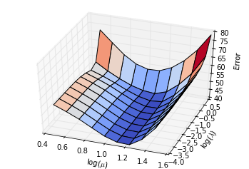
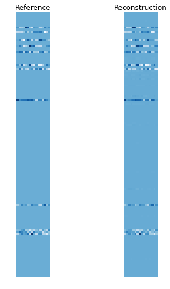
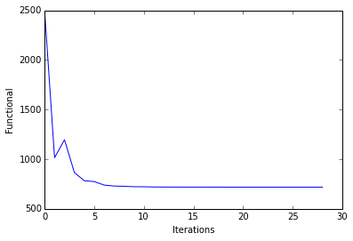
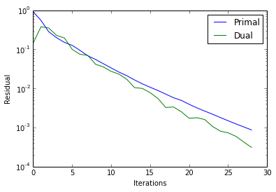
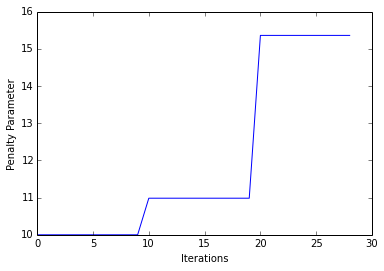

Solving the Joint-Sparse BPDN problem using SPORCO
==================================================

This notebook demonstrates the use of SPORCO to solve the Basis Pursuit
DeNoising (BPDN) problem with a joint sparsity-promoting term

.. math:: \mathrm{argmin}_X \; (1/2) \| D X - S \|_2^2 + \lambda \| X \|_1 + \mu \| X \|_{2,1}

where :math:`D` is the dictionary, :math:`X` is the set of sparse
representations, and :math:`S` is the set of signals to be represented.
In this example (based on the ``demo_bpdnjnt.py`` example script) the
BPDN problem is used to estimate the reference jointly sparse
representations that generated a set of signals from a noisy version of
the signals.

Import modules and configure matplotlib output to notebook.

.. code:: ipython3

    from __future__ import print_function
    from builtins import input
    from builtins import range
    
    import numpy as np
    
    from sporco import util
    from sporco import plot
    from sporco.admm import bpdn
    
    %matplotlib inline

Configure problem size, sparsity, and noise level.

.. code:: ipython3

    # Signal and dictionary size
    N = 32
    M = 4*N
    # Number of non-zero coefficients in generator
    L = 12
    # Number of signals
    K = 16;
    # Noise level
    sigma = 0.5

Construct random dictionary, reference random sparse representation, and
test signal consisting of the synthesis of the reference sparse
representation with additive Gaussian noise.

.. code:: ipython3

    # Construct random dictionary and random sparse coefficients
    np.random.seed(12345)
    D = np.random.randn(N, M)
    x0 = np.zeros((M, K))
    si = np.random.permutation(list(range(0, M-1)))
    x0[si[0:L],:] = np.random.randn(L, K)
    
    # Construct reference and noisy signal
    s0 = D.dot(x0)
    s = s0 + sigma*np.random.randn(N,K)

Set solver class options for BPDN with joint sparsity promoting term.

.. code:: ipython3

    # Set BPDNJoint options
    opt = bpdn.BPDNJoint.Options({'Verbose' : False, 'MaxMainIter' : 500,
                                  'RelStopTol' : 1e-3, 'rho' : 10.0,
                                  'AutoRho' : {'RsdlTarget' : 1.0}})

Select regularization parameters :math:`\lambda` and :math:`\mu` by
evaluating the error in recovering the sparse representation over a
logarithmicaly spaced grid. (The reference representation is assumed to
be known, which is not realistic in a real application.) A function is
defined that evalues the joint-sparse BPDN recovery error for a
specified :math:`\lambda, \mu`, and this function is evaluated in
parallel by ``sporco.util.grid_search``.

.. code:: ipython3

    # Function computing reconstruction error for (lmbda, mu) pair
    def evalerr(prm):
        lmbda = prm[0]
        mu = prm[1]
        b = bpdn.BPDNJoint(D, s, lmbda, mu, opt)
        x = b.solve()
        return np.sum(np.abs(x-x0))
    
    
    # Parallel evalution of error function on lmbda,mu grid
    lrng = np.logspace(-4, 0.5, 10)
    mrng = np.logspace(0.5, 1.6, 10)
    sprm, sfvl, fvmx, sidx = util.grid_search(evalerr, (lrng, mrng))
    lmbda = sprm[0]
    mu = sprm[1]
    
    print('Minimum ℓ1 error: %5.2f at (𝜆,μ) = (%.2e, %.2e)' % (sfvl, lmbda, mu))

.. parsed-literal::

    Minimum ℓ1 error: 40.36 at (𝜆,μ) = (1.00e-04, 1.71e+01)

Plot recovery error against :math:`\lambda` and :math:`\mu`.

.. code:: ipython3

    fg = plot.figure()
    ax = plot.plt.axes(projection='3d')
    ax.view_init(elev=40, azim=-70)
    ax.xaxis._axinfo['label']['space_factor'] = 2.0
    ax.yaxis._axinfo['label']['space_factor'] = 2.0
    ax.zaxis._axinfo['label']['space_factor'] = 2.0
    fgax = plot.surf(fvmx, x=np.log10(mrng), y=np.log10(lrng), xlbl='log($\mu$)',
                       ylbl='log($\lambda$)', zlbl='Error', fgrf=fg, axrf=ax)

Once the best :math:`\lambda, \mu` have been determined, run
joint-sparse BPDN with verbose display of ADMM iteration statistics.

.. code:: ipython3

    # Initialise and run BPDNJoint object for best lmbda and mu
    opt['Verbose'] = True
    b = bpdn.BPDNJoint(D, s, lmbda, mu, opt)
    b.solve()
    
    print("BPDNJoint solve time: %.2fs" % b.runtime)

.. parsed-literal::

    Itn   Fnc       DFid      Regℓ1     Regℓ2,1   r         s         ρ         
    --------------------------------------------------------------------------
       0  2.50e+03  2.44e+03  1.08e+01  3.18e+00  9.14e-01  1.43e-01  1.00e+01
       1  1.01e+03  5.79e+02  8.48e+01  2.55e+01  5.50e-01  3.77e-01  1.00e+01
       2  1.20e+03  4.44e+02  1.46e+02  4.39e+01  2.81e-01  3.51e-01  1.00e+01
       3  8.65e+02  1.72e+02  1.35e+02  4.05e+01  1.99e-01  2.26e-01  1.00e+01
       4  7.83e+02  1.76e+02  1.19e+02  3.55e+01  1.51e-01  1.96e-01  1.00e+01
       5  7.74e+02  2.04e+02  1.13e+02  3.33e+01  1.27e-01  1.00e-01  1.00e+01
       6  7.39e+02  1.54e+02  1.16e+02  3.42e+01  9.41e-02  7.47e-02  1.00e+01
       7  7.30e+02  1.08e+02  1.23e+02  3.63e+01  6.86e-02  7.00e-02  1.00e+01
       8  7.27e+02  9.87e+01  1.24e+02  3.67e+01  5.50e-02  4.15e-02  1.00e+01
       9  7.23e+02  1.12e+02  1.20e+02  3.57e+01  4.29e-02  3.56e-02  1.00e+01
      10  7.22e+02  1.21e+02  1.18e+02  3.51e+01  3.34e-02  2.73e-02  1.10e+01
      11  7.20e+02  1.09e+02  1.20e+02  3.57e+01  2.62e-02  2.32e-02  1.10e+01
      12  7.19e+02  9.89e+01  1.22e+02  3.63e+01  2.12e-02  1.72e-02  1.10e+01
      13  7.19e+02  1.01e+02  1.21e+02  3.61e+01  1.65e-02  1.05e-02  1.10e+01
      14  7.19e+02  1.05e+02  1.21e+02  3.59e+01  1.31e-02  9.99e-03  1.10e+01
      15  7.19e+02  1.05e+02  1.21e+02  3.59e+01  1.07e-02  7.80e-03  1.10e+01
      16  7.19e+02  1.01e+02  1.21e+02  3.61e+01  8.85e-03  5.53e-03  1.10e+01
      17  7.18e+02  1.01e+02  1.21e+02  3.61e+01  7.16e-03  3.25e-03  1.10e+01
      18  7.18e+02  1.02e+02  1.21e+02  3.60e+01  5.79e-03  3.35e-03  1.10e+01
      19  7.18e+02  1.02e+02  1.21e+02  3.60e+01  4.95e-03  2.53e-03  1.10e+01
      20  7.18e+02  1.01e+02  1.21e+02  3.61e+01  3.93e-03  1.73e-03  1.54e+01
      21  7.18e+02  1.01e+02  1.21e+02  3.61e+01  3.18e-03  1.78e-03  1.54e+01
      22  7.18e+02  1.01e+02  1.21e+02  3.61e+01  2.63e-03  1.60e-03  1.54e+01
      23  7.18e+02  1.01e+02  1.21e+02  3.61e+01  2.19e-03  1.07e-03  1.54e+01
      24  7.18e+02  1.01e+02  1.21e+02  3.61e+01  1.81e-03  8.09e-04  1.54e+01
      25  7.18e+02  1.01e+02  1.21e+02  3.61e+01  1.49e-03  7.34e-04  1.54e+01
      26  7.18e+02  1.01e+02  1.21e+02  3.61e+01  1.24e-03  5.96e-04  1.54e+01
      27  7.18e+02  1.01e+02  1.21e+02  3.61e+01  1.04e-03  4.27e-04  1.54e+01
      28  7.18e+02  1.01e+02  1.21e+02  3.61e+01  8.69e-04  3.11e-04  1.54e+01
    --------------------------------------------------------------------------
    BPDNJoint solve time: 0.03s

Display comparison of reference and recovered representations.

.. code:: ipython3

    # Display results
    fig1 = plot.figure(1, figsize=(6,8))
    plot.subplot(1,2,1)
    plot.imview(x0, fgrf=fig1, cmap=plot.cm.Blues, title='Reference')
    plot.subplot(1,2,2)
    fgax = plot.imview(b.Y, fgrf=fig1, cmap=plot.cm.Blues, title='Reconstruction')

Plot functional evolution during ADMM iterations.

.. code:: ipython3

    its = b.getitstat()
    plot.plot(its.ObjFun, xlbl='Iterations', ylbl='Functional')
    plot.close()

Plot evolution of ADMM residuals and ADMM penalty parameter.

.. code:: ipython3

    plot.plot(np.vstack((its.PrimalRsdl, its.DualRsdl)).T, 
              ptyp='semilogy', xlbl='Iterations', ylbl='Residual',
              lgnd=['Primal', 'Dual']);
    plot.plot(its.Rho, xlbl='Iterations', ylbl='Penalty Parameter')
    plot.close()

