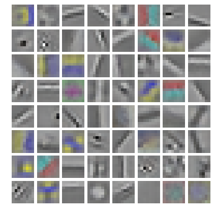
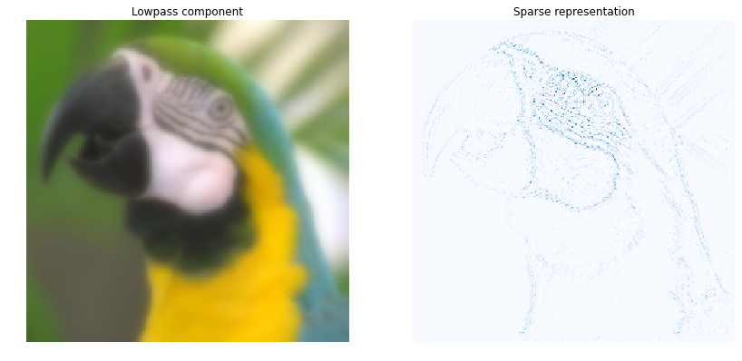
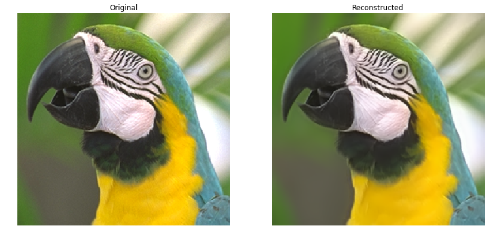
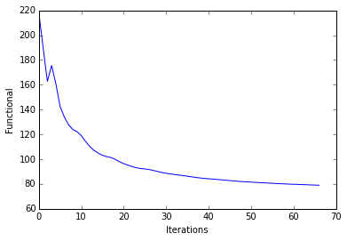
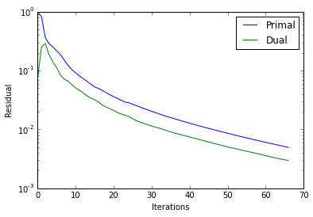
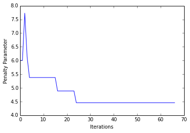

Multi-channel Convolutional Sparse Coding
=========================================

This notebook demonstrates the use of SPORCO to solve a convolutional
sparse coding problem with a colour dictionary and a colour signal

.. math:: \mathrm{argmin}_\mathbf{x} \; (1/2) \sum_c \left\| \sum_m \mathbf{d}_{c,m} * \mathbf{x}_m -\mathbf{s}_c \right\|_2^2 + \lambda \sum_m \| \mathbf{x}_m \|_1

where :math:`\mathbf{d}_{c,m}` is channel :math:`c` of the
:math:`m^{\text{th}}` dictionary filter, :math:`\mathbf{x}_m` is the
coefficient map corresponding to the :math:`m^{\text{th}}` dictionary
filter, and :math:`\mathbf{s}_c` is channel :math:`c` of the input
image.

Import modules and configure matplotlib output to notebook.

.. code:: ipython3

    from __future__ import print_function
    from builtins import input
    from builtins import range
    
    import numpy as np
    
    from sporco import util
    from sporco import plot
    import sporco.metric as sm
    from sporco.admm import cbpdn
    
    %matplotlib inline

Load test image and compute lowpass and highpass components.

.. code:: ipython3

    # Load test image
    img = util.ExampleImages().image('kodim23', scaled=True)[160:416,60:316]
    
    # Highpass filter test image
    npd = 16
    fltlmbd = 10
    sl, sh = util.tikhonov_filter(img, fltlmbd, npd)

Load colour dictionary and display it.

.. code:: ipython3

    # Load dictionary
    D = util.convdicts()['RGB:8x8x3x64']
    
    # Display dictionary
    fig = plot.figure(figsize=(7,7))
    fgax = plot.imview(util.tiledict(D), fgrf=fig)

Set CBPDN solver class options.

.. code:: ipython3

    # Set up ConvBPDN options
    lmbda = 1e-1
    opt = cbpdn.ConvBPDN.Options({'Verbose' : True, 'MaxMainIter' : 200,
                                  'LinSolveCheck' : True, 'RelStopTol' : 5e-3,
                                  'AuxVarObj' : False})

Initialise and run CBPDN solver and then reconstruct image from sparse
representation.

.. code:: ipython3

    # Solve CBPDN problem
    b = cbpdn.ConvBPDN(D, sh, lmbda, opt)
    X = b.solve()
    
    print("ConvBPDN solve time: %.2fs" % b.runtime)
    
    # Reconstruct representation
    shr = b.reconstruct().squeeze()
    imgr = sl + shr
    print("Reconstruction PSNR: %.2fdB\n" % sm.psnr(img, imgr))

.. parsed-literal::

    Itn   Fnc       DFid      Regℓ1     r         s         ρ         
    ----------------------------------------------------------------
       0  2.18e+02  2.09e+00  2.16e+03  9.76e-01  7.28e-02  6.00e+00
       1  1.90e+02  8.55e+00  1.81e+03  8.24e-01  2.48e-01  6.00e+00
       2  1.63e+02  1.27e+01  1.50e+03  3.62e-01  2.87e-01  7.73e+00
       3  1.76e+02  1.39e+01  1.62e+03  2.86e-01  1.86e-01  6.13e+00
       4  1.61e+02  1.40e+01  1.47e+03  2.51e-01  1.40e-01  5.38e+00
       5  1.43e+02  1.48e+01  1.28e+03  2.17e-01  1.12e-01  5.38e+00
       6  1.34e+02  1.58e+01  1.18e+03  1.86e-01  8.34e-02  5.38e+00
       7  1.28e+02  1.67e+01  1.11e+03  1.50e-01  7.15e-02  5.38e+00
       8  1.24e+02  1.72e+01  1.07e+03  1.22e-01  6.59e-02  5.38e+00
       9  1.22e+02  1.74e+01  1.05e+03  1.04e-01  5.75e-02  5.38e+00
      10  1.19e+02  1.75e+01  1.01e+03  9.12e-02  5.05e-02  5.38e+00
      11  1.14e+02  1.76e+01  9.66e+02  8.12e-02  4.61e-02  5.38e+00
      12  1.10e+02  1.79e+01  9.23e+02  7.29e-02  4.16e-02  5.38e+00
      13  1.07e+02  1.81e+01  8.90e+02  6.56e-02  3.71e-02  5.38e+00
      14  1.05e+02  1.83e+01  8.65e+02  5.86e-02  3.39e-02  5.38e+00
      15  1.03e+02  1.85e+01  8.45e+02  5.25e-02  3.18e-02  5.38e+00
      16  1.02e+02  1.86e+01  8.34e+02  4.97e-02  2.92e-02  4.89e+00
      17  1.01e+02  1.86e+01  8.27e+02  4.58e-02  2.61e-02  4.89e+00
      18  9.99e+01  1.87e+01  8.12e+02  4.22e-02  2.40e-02  4.89e+00
      19  9.79e+01  1.87e+01  7.92e+02  3.89e-02  2.25e-02  4.89e+00
      20  9.64e+01  1.88e+01  7.76e+02  3.61e-02  2.10e-02  4.89e+00
      21  9.51e+01  1.89e+01  7.63e+02  3.36e-02  1.94e-02  4.89e+00
      22  9.41e+01  1.90e+01  7.51e+02  3.13e-02  1.82e-02  4.89e+00
      23  9.31e+01  1.90e+01  7.40e+02  2.91e-02  1.75e-02  4.89e+00
      24  9.24e+01  1.91e+01  7.34e+02  2.83e-02  1.65e-02  4.46e+00
      25  9.21e+01  1.91e+01  7.30e+02  2.68e-02  1.52e-02  4.46e+00
      26  9.16e+01  1.91e+01  7.25e+02  2.53e-02  1.41e-02  4.46e+00
      27  9.09e+01  1.92e+01  7.17e+02  2.39e-02  1.33e-02  4.46e+00
      28  9.00e+01  1.92e+01  7.08e+02  2.26e-02  1.26e-02  4.46e+00
      29  8.93e+01  1.92e+01  7.01e+02  2.14e-02  1.20e-02  4.46e+00
      30  8.87e+01  1.93e+01  6.94e+02  2.03e-02  1.14e-02  4.46e+00
      31  8.81e+01  1.93e+01  6.88e+02  1.93e-02  1.09e-02  4.46e+00
      32  8.76e+01  1.93e+01  6.83e+02  1.83e-02  1.05e-02  4.46e+00
      33  8.72e+01  1.94e+01  6.78e+02  1.74e-02  1.00e-02  4.46e+00
      34  8.67e+01  1.94e+01  6.74e+02  1.66e-02  9.54e-03  4.46e+00
      35  8.63e+01  1.94e+01  6.69e+02  1.59e-02  9.09e-03  4.46e+00
      36  8.58e+01  1.94e+01  6.64e+02  1.52e-02  8.69e-03  4.46e+00
      37  8.53e+01  1.94e+01  6.58e+02  1.45e-02  8.36e-03  4.46e+00
      38  8.48e+01  1.95e+01  6.54e+02  1.39e-02  8.06e-03  4.46e+00
      39  8.45e+01  1.95e+01  6.50e+02  1.33e-02  7.75e-03  4.46e+00
      40  8.42e+01  1.95e+01  6.47e+02  1.27e-02  7.43e-03  4.46e+00
      41  8.40e+01  1.95e+01  6.44e+02  1.22e-02  7.12e-03  4.46e+00
      42  8.37e+01  1.95e+01  6.41e+02  1.17e-02  6.88e-03  4.46e+00
      43  8.33e+01  1.96e+01  6.38e+02  1.12e-02  6.64e-03  4.46e+00
      44  8.30e+01  1.96e+01  6.35e+02  1.08e-02  6.37e-03  4.46e+00
      45  8.27e+01  1.96e+01  6.32e+02  1.04e-02  6.11e-03  4.46e+00
      46  8.24e+01  1.96e+01  6.29e+02  1.00e-02  5.88e-03  4.46e+00
      47  8.22e+01  1.96e+01  6.26e+02  9.65e-03  5.66e-03  4.46e+00
      48  8.19e+01  1.96e+01  6.23e+02  9.28e-03  5.45e-03  4.46e+00
      49  8.17e+01  1.96e+01  6.21e+02  8.94e-03  5.23e-03  4.46e+00
      50  8.15e+01  1.97e+01  6.19e+02  8.61e-03  5.05e-03  4.46e+00
      51  8.13e+01  1.97e+01  6.17e+02  8.29e-03  4.88e-03  4.46e+00
      52  8.11e+01  1.97e+01  6.14e+02  7.99e-03  4.72e-03  4.46e+00
      53  8.09e+01  1.97e+01  6.13e+02  7.70e-03  4.56e-03  4.46e+00
      54  8.07e+01  1.97e+01  6.11e+02  7.44e-03  4.40e-03  4.46e+00
      55  8.06e+01  1.97e+01  6.09e+02  7.18e-03  4.25e-03  4.46e+00
      56  8.04e+01  1.97e+01  6.07e+02  6.93e-03  4.12e-03  4.46e+00
      57  8.02e+01  1.97e+01  6.05e+02  6.69e-03  4.00e-03  4.46e+00
      58  8.00e+01  1.97e+01  6.03e+02  6.47e-03  3.85e-03  4.46e+00
      59  7.99e+01  1.97e+01  6.02e+02  6.25e-03  3.72e-03  4.46e+00
      60  7.98e+01  1.97e+01  6.00e+02  6.04e-03  3.59e-03  4.46e+00
      61  7.96e+01  1.97e+01  5.99e+02  5.84e-03  3.46e-03  4.46e+00
      62  7.95e+01  1.97e+01  5.98e+02  5.65e-03  3.34e-03  4.46e+00
      63  7.94e+01  1.98e+01  5.96e+02  5.47e-03  3.23e-03  4.46e+00
      64  7.93e+01  1.98e+01  5.95e+02  5.29e-03  3.14e-03  4.46e+00
      65  7.91e+01  1.98e+01  5.94e+02  5.12e-03  3.05e-03  4.46e+00
      66  7.90e+01  1.98e+01  5.92e+02  4.95e-03  2.97e-03  4.46e+00
    ----------------------------------------------------------------
    ConvBPDN solve time: 49.61s
    Reconstruction PSNR: 36.87dB
    

Display low pass component and sum of absolute values of coefficient
maps of highpass component.

.. code:: ipython3

    fig = plot.figure(figsize=(14,7))
    plot.subplot(1,2,1)
    fgax = plot.imview(sl, title='Lowpass component', fgrf=fig)
    plot.subplot(1,2,2)
    fgax = plot.imview(np.sum(abs(X), axis=b.cri.axisM).squeeze(), cmap=plot.cm.Blues,
                title='Sparse representation', fgrf=fig)

Display original and reconstructed images.

.. code:: ipython3

    fig = plot.figure(figsize=(14,7))
    plot.subplot(1,2,1)
    fgax = plot.imview(img, title='Original', fgrf=fig)
    plot.subplot(1,2,2)
    fgax = plot.imview(imgr, title='Reconstructed', fgrf=fig)

Plot functional evolution during ADMM iterations.

.. code:: ipython3

    its = b.getitstat()
    plot.plot(its.ObjFun, xlbl='Iterations', ylbl='Functional')
    plot.close()

Plot evolution of ADMM residuals and ADMM penalty parameter.

.. code:: ipython3

    plot.plot(np.vstack((its.PrimalRsdl, its.DualRsdl)).T,
              ptyp='semilogy', xlbl='Iterations', ylbl='Residual',
              lgnd=['Primal', 'Dual']);
    plot.plot(its.Rho, xlbl='Iterations', ylbl='Penalty Parameter')
    plot.close()

