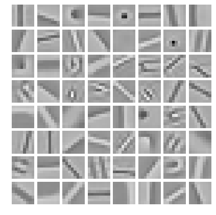
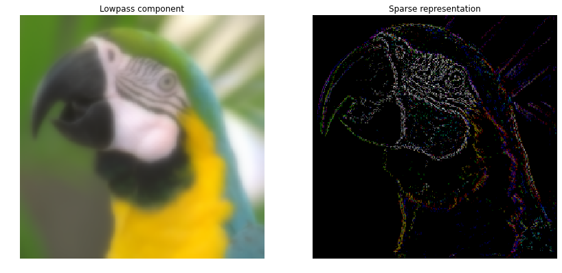
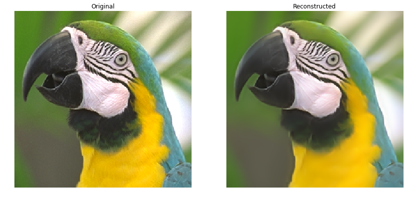
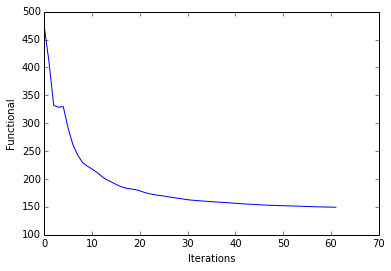
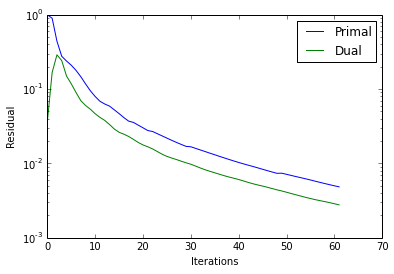
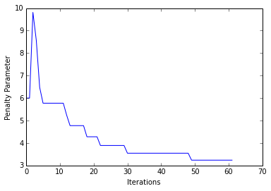

Multi-channel Convolutional Sparse Coding
=========================================

This notebook demonstrates the use of SPORCO to solve a convolutional
sparse coding problem with a greyscale dictionary and a colour signal

.. math:: \mathrm{argmin}_\mathbf{x} \; (1/2) \sum_c \left\| \sum_m \mathbf{d}_m * \mathbf{x}_{c,m} - \mathbf{s}_c \right\|_2^2 + \lambda \sum_c \sum_m \| \mathbf{x}_{c,m} \|_1

where :math:`\mathbf{d}_{m}` is the :math:`m^{\text{th}}` dictionary
filter, :math:`\mathbf{x}_{c,m}` is the coefficient map corresponding to
the :math:`m^{\text{th}}` dictionary filter and channel :math:`c` of the
input image, and :math:`\mathbf{s}_c` is channel :math:`c` of the input
image.

Import modules and configure matplotlib output to notebook.

.. code:: ipython3

    from __future__ import print_function
    from builtins import input
    from builtins import range
    
    import numpy as np
    
    from sporco import util
    from sporco import plot
    import sporco.metric as sm
    from sporco.admm import cbpdn
    
    %matplotlib inline

Load test image and compute lowpass and highpass components.

.. code:: ipython3

    # Load test image
    img = util.ExampleImages().image('kodim23', scaled=True)[160:416,60:316]
    
    # Highpass filter test image
    npd = 16
    fltlmbd = 10
    sl, sh = util.tikhonov_filter(img, fltlmbd, npd)

Load colour dictionary and display it.

.. code:: ipython3

    # Load dictionary
    D = util.convdicts()['G:8x8x64']
    
    # Display dictionary
    fig = plot.figure(figsize=(7,7))
    fgax = plot.imview(util.tiledict(D), fgrf=fig)

Set CBPDN solver class options.

.. code:: ipython3

    # Set up ConvBPDN options
    lmbda = 1e-1
    opt = cbpdn.ConvBPDN.Options({'Verbose' : True, 'MaxMainIter' : 200,
                                  'LinSolveCheck' : True, 'RelStopTol' : 5e-3,
                                  'AuxVarObj' : False})

Initialise and run CBPDN solver and then reconstruct image from sparse
representation.

.. code:: ipython3

    # Solve CBPDN problem
    b = cbpdn.ConvBPDN(D, sh, lmbda, opt, dimK=0)
    X = b.solve()
    
    print("ConvBPDN solve time: %.2fs" % b.runtime)
    
    # Reconstruct representation
    shr = b.reconstruct().squeeze()
    imgr = sl + shr
    print("Reconstruction PSNR: %.2fdB\n" % sm.psnr(img, imgr))

.. parsed-literal::

    Itn   Fnc       DFid      Regℓ1     r         s         ρ         
    ----------------------------------------------------------------
       0  4.75e+02  3.05e+00  4.72e+03  9.92e-01  3.67e-02  6.00e+00
       1  4.11e+02  1.66e+01  3.94e+03  8.92e-01  1.67e-01  6.00e+00
       2  3.32e+02  3.15e+01  3.00e+03  4.39e-01  2.88e-01  9.81e+00
       3  3.29e+02  3.77e+01  2.91e+03  2.75e-01  2.41e-01  8.57e+00
       4  3.30e+02  3.64e+01  2.93e+03  2.38e-01  1.50e-01  6.48e+00
       5  2.92e+02  3.60e+01  2.56e+03  2.09e-01  1.17e-01  5.77e+00
       6  2.62e+02  3.72e+01  2.25e+03  1.78e-01  8.95e-02  5.77e+00
       7  2.43e+02  3.92e+01  2.04e+03  1.46e-01  6.96e-02  5.77e+00
       8  2.30e+02  4.11e+01  1.89e+03  1.17e-01  5.99e-02  5.77e+00
       9  2.23e+02  4.23e+01  1.81e+03  9.44e-02  5.34e-02  5.77e+00
      10  2.18e+02  4.29e+01  1.75e+03  7.92e-02  4.65e-02  5.77e+00
      11  2.12e+02  4.31e+01  1.69e+03  6.83e-02  4.15e-02  5.77e+00
      12  2.05e+02  4.32e+01  1.62e+03  6.28e-02  3.78e-02  5.24e+00
      13  1.99e+02  4.35e+01  1.56e+03  5.88e-02  3.33e-02  4.77e+00
      14  1.95e+02  4.38e+01  1.51e+03  5.25e-02  2.90e-02  4.77e+00
      15  1.90e+02  4.42e+01  1.46e+03  4.67e-02  2.62e-02  4.77e+00
      16  1.86e+02  4.46e+01  1.42e+03  4.13e-02  2.47e-02  4.77e+00
      17  1.84e+02  4.48e+01  1.39e+03  3.70e-02  2.30e-02  4.77e+00
      18  1.82e+02  4.50e+01  1.37e+03  3.56e-02  2.10e-02  4.28e+00
      19  1.81e+02  4.50e+01  1.36e+03  3.27e-02  1.91e-02  4.28e+00
      20  1.79e+02  4.51e+01  1.34e+03  3.01e-02  1.77e-02  4.28e+00
      21  1.76e+02  4.52e+01  1.31e+03  2.76e-02  1.67e-02  4.28e+00
      22  1.74e+02  4.53e+01  1.28e+03  2.69e-02  1.57e-02  3.89e+00
      23  1.72e+02  4.54e+01  1.27e+03  2.51e-02  1.44e-02  3.89e+00
      24  1.71e+02  4.55e+01  1.25e+03  2.34e-02  1.33e-02  3.89e+00
      25  1.69e+02  4.56e+01  1.24e+03  2.19e-02  1.24e-02  3.89e+00
      26  1.68e+02  4.57e+01  1.22e+03  2.04e-02  1.18e-02  3.89e+00
      27  1.67e+02  4.58e+01  1.21e+03  1.91e-02  1.13e-02  3.89e+00
      28  1.65e+02  4.59e+01  1.20e+03  1.80e-02  1.07e-02  3.89e+00
      29  1.64e+02  4.59e+01  1.18e+03  1.69e-02  1.02e-02  3.89e+00
      30  1.63e+02  4.60e+01  1.17e+03  1.67e-02  9.74e-03  3.55e+00
      31  1.62e+02  4.61e+01  1.16e+03  1.59e-02  9.20e-03  3.55e+00
      32  1.61e+02  4.61e+01  1.15e+03  1.51e-02  8.67e-03  3.55e+00
      33  1.61e+02  4.62e+01  1.14e+03  1.44e-02  8.21e-03  3.55e+00
      34  1.60e+02  4.63e+01  1.14e+03  1.37e-02  7.83e-03  3.55e+00
      35  1.59e+02  4.64e+01  1.13e+03  1.31e-02  7.48e-03  3.55e+00
      36  1.59e+02  4.64e+01  1.12e+03  1.24e-02  7.14e-03  3.55e+00
      37  1.58e+02  4.65e+01  1.12e+03  1.18e-02  6.83e-03  3.55e+00
      38  1.58e+02  4.65e+01  1.11e+03  1.13e-02  6.55e-03  3.55e+00
      39  1.57e+02  4.65e+01  1.11e+03  1.08e-02  6.31e-03  3.55e+00
      40  1.56e+02  4.66e+01  1.10e+03  1.03e-02  6.07e-03  3.55e+00
      41  1.56e+02  4.66e+01  1.09e+03  9.87e-03  5.81e-03  3.55e+00
      42  1.55e+02  4.66e+01  1.09e+03  9.46e-03  5.55e-03  3.55e+00
      43  1.55e+02  4.67e+01  1.08e+03  9.09e-03  5.32e-03  3.55e+00
      44  1.54e+02  4.67e+01  1.08e+03  8.71e-03  5.13e-03  3.55e+00
      45  1.54e+02  4.68e+01  1.07e+03  8.34e-03  4.96e-03  3.55e+00
      46  1.53e+02  4.68e+01  1.07e+03  7.99e-03  4.78e-03  3.55e+00
      47  1.53e+02  4.69e+01  1.06e+03  7.66e-03  4.59e-03  3.55e+00
      48  1.53e+02  4.69e+01  1.06e+03  7.35e-03  4.41e-03  3.55e+00
      49  1.52e+02  4.69e+01  1.05e+03  7.39e-03  4.26e-03  3.24e+00
      50  1.52e+02  4.69e+01  1.05e+03  7.13e-03  4.10e-03  3.24e+00
      51  1.52e+02  4.69e+01  1.05e+03  6.88e-03  3.93e-03  3.24e+00
      52  1.52e+02  4.70e+01  1.05e+03  6.65e-03  3.78e-03  3.24e+00
      53  1.51e+02  4.70e+01  1.04e+03  6.42e-03  3.64e-03  3.24e+00
      54  1.51e+02  4.70e+01  1.04e+03  6.21e-03  3.50e-03  3.24e+00
      55  1.51e+02  4.70e+01  1.04e+03  5.99e-03  3.37e-03  3.24e+00
      56  1.50e+02  4.71e+01  1.03e+03  5.77e-03  3.26e-03  3.24e+00
      57  1.50e+02  4.71e+01  1.03e+03  5.56e-03  3.16e-03  3.24e+00
      58  1.50e+02  4.71e+01  1.03e+03  5.36e-03  3.07e-03  3.24e+00
      59  1.50e+02  4.71e+01  1.03e+03  5.18e-03  2.97e-03  3.24e+00
      60  1.50e+02  4.72e+01  1.02e+03  5.00e-03  2.87e-03  3.24e+00
      61  1.49e+02  4.72e+01  1.02e+03  4.84e-03  2.77e-03  3.24e+00
    ----------------------------------------------------------------
    ConvBPDN solve time: 56.00s
    Reconstruction PSNR: 33.13dB
    

Display low pass component and sum of absolute values of coefficient
maps of highpass component.

.. code:: ipython3

    gamma = lambda x, g: x**g
    fig = plot.figure(figsize=(14,7))
    plot.subplot(1,2,1)
    fgax = plot.imview(sl, title='Lowpass component', fgrf=fig)
    plot.subplot(1,2,2)
    fgax = plot.imview(gamma(np.sum(abs(X), axis=b.cri.axisM).squeeze(), 0.4),
                title='Sparse representation', fgrf=fig)

Display original and reconstructed images.

.. code:: ipython3

    fig = plot.figure(figsize=(14,7))
    plot.subplot(1,2,1)
    fgax = plot.imview(img, title='Original', fgrf=fig)
    plot.subplot(1,2,2)
    fgax = plot.imview(imgr, title='Reconstructed', fgrf=fig)

Plot functional evolution during ADMM iterations.

.. code:: ipython3

    its = b.getitstat()
    plot.plot(its.ObjFun, xlbl='Iterations', ylbl='Functional')
    plot.close()

Plot evolution of ADMM residuals and ADMM penalty parameter.

.. code:: ipython3

    plot.plot(np.vstack((its.PrimalRsdl, its.DualRsdl)).T,
              ptyp='semilogy', xlbl='Iterations', ylbl='Residual',
              lgnd=['Primal', 'Dual']);
    plot.plot(its.Rho, xlbl='Iterations', ylbl='Penalty Parameter')
    plot.close()

