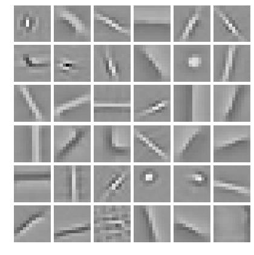
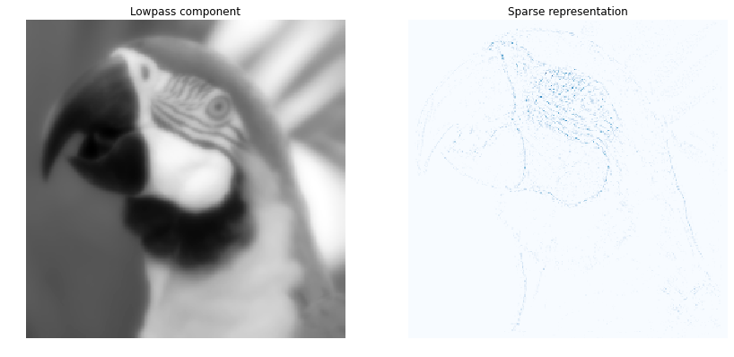
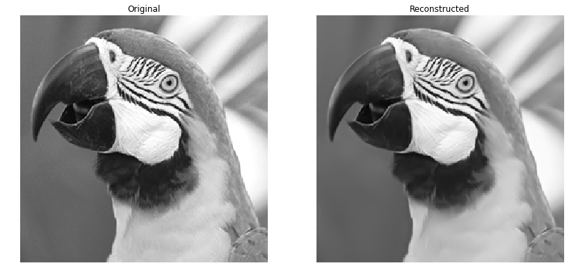
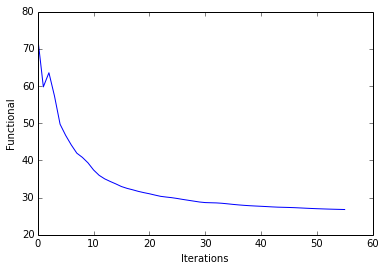
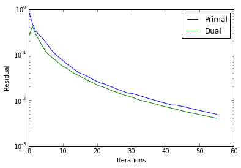
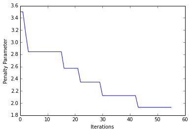

Single-channel Convolutional Sparse Coding
==========================================

This notebook demonstrates the use of SPORCO to solve a convolutional
sparse coding problem with a greyscale signal

.. math:: \mathrm{argmin}_\mathbf{x} \; \frac{1}{2} \left\| \sum_m \mathbf{d}_m * \mathbf{x}_{m} - \mathbf{s} \right\|_2^2 + \lambda \sum_m \| \mathbf{x}_{m} \|_1

where :math:`\mathbf{d}_{m}` is the :math:`m^{\text{th}}` dictionary
filter, :math:`\mathbf{x}_{m}` is the coefficient map corresponding to
the :math:`m^{\text{th}}` dictionary filter, and :math:`\mathbf{s}` is
the input image.

Import modules and configure matplotlib output to notebook.

.. code:: ipython3

    from __future__ import print_function
    from builtins import input
    from builtins import range
    
    import numpy as np
    
    from sporco import util
    from sporco import plot
    import sporco.metric as sm
    from sporco.admm import cbpdn
    
    %matplotlib inline

Load test image and compute lowpass and highpass components.

.. code:: ipython3

    # Load test image
    img = util.rgb2gray(util.ExampleImages().image('kodim23', scaled=True)[160:416,60:316])
    
    # Highpass filter test image
    npd = 16
    fltlmbd = 10
    sl, sh = util.tikhonov_filter(img, fltlmbd, npd)

Load colour dictionary and display it.

.. code:: ipython3

    # Load dictionary
    D = util.convdicts()['G:12x12x36']
    
    # Display dictionary
    fig = plot.figure(figsize=(7,7))
    fgax = plot.imview(util.tiledict(D), fgrf=fig)

Set CBPDN solver class options.

.. code:: ipython3

    # Set up ConvBPDN options
    lmbda = 5e-2
    opt = cbpdn.ConvBPDN.Options({'Verbose' : True, 'MaxMainIter' : 200,
                                  'LinSolveCheck' : True, 'RelStopTol' : 5e-3,
                                  'AuxVarObj' : False})

Initialise and run CBPDN solver and then reconstruct image from sparse
representation.

.. code:: ipython3

    # Solve CBPDN problem
    b = cbpdn.ConvBPDN(D, sh, lmbda, opt, dimK=0)
    X = b.solve()
    
    print("ConvBPDN solve time: %.2fs" % b.runtime)
    
    # Reconstruct representation
    shr = b.reconstruct().squeeze()
    imgr = sl + shr
    print("Reconstruction PSNR: %.2fdB\n" % sm.psnr(img, imgr))

.. parsed-literal::

    Itn   Fnc       DFid      Regℓ1     r         s         ρ         
    ----------------------------------------------------------------
       0  7.29e+01  8.03e-01  1.44e+03  8.61e-01  2.50e-01  3.50e+00
       1  5.98e+01  3.39e+00  1.13e+03  4.81e-01  4.19e-01  3.50e+00
       2  6.36e+01  3.81e+00  1.20e+03  3.21e-01  2.78e-01  3.15e+00
       3  5.73e+01  3.83e+00  1.07e+03  2.69e-01  2.05e-01  2.84e+00
       4  4.97e+01  4.12e+00  9.12e+02  2.27e-01  1.51e-01  2.84e+00
       5  4.67e+01  4.49e+00  8.45e+02  1.84e-01  1.13e-01  2.84e+00
       6  4.42e+01  4.73e+00  7.89e+02  1.44e-01  9.63e-02  2.84e+00
       7  4.19e+01  4.84e+00  7.42e+02  1.17e-01  8.34e-02  2.84e+00
       8  4.08e+01  4.89e+00  7.18e+02  9.80e-02  7.33e-02  2.84e+00
       9  3.93e+01  4.94e+00  6.88e+02  8.46e-02  6.20e-02  2.84e+00
      10  3.74e+01  5.01e+00  6.48e+02  7.33e-02  5.47e-02  2.84e+00
      11  3.60e+01  5.10e+00  6.18e+02  6.33e-02  5.07e-02  2.84e+00
      12  3.50e+01  5.16e+00  5.97e+02  5.55e-02  4.52e-02  2.84e+00
      13  3.43e+01  5.21e+00  5.82e+02  4.91e-02  3.97e-02  2.84e+00
      14  3.37e+01  5.25e+00  5.68e+02  4.35e-02  3.63e-02  2.84e+00
      15  3.30e+01  5.28e+00  5.54e+02  3.88e-02  3.35e-02  2.84e+00
      16  3.25e+01  5.31e+00  5.44e+02  3.69e-02  3.03e-02  2.57e+00
      17  3.21e+01  5.33e+00  5.35e+02  3.35e-02  2.74e-02  2.57e+00
      18  3.17e+01  5.35e+00  5.27e+02  3.04e-02  2.55e-02  2.57e+00
      19  3.13e+01  5.37e+00  5.19e+02  2.79e-02  2.36e-02  2.57e+00
      20  3.10e+01  5.39e+00  5.13e+02  2.57e-02  2.15e-02  2.57e+00
      21  3.07e+01  5.40e+00  5.06e+02  2.36e-02  2.01e-02  2.57e+00
      22  3.03e+01  5.42e+00  4.99e+02  2.28e-02  1.91e-02  2.34e+00
      23  3.02e+01  5.43e+00  4.95e+02  2.12e-02  1.79e-02  2.34e+00
      24  3.00e+01  5.43e+00  4.91e+02  1.98e-02  1.65e-02  2.34e+00
      25  2.98e+01  5.43e+00  4.87e+02  1.85e-02  1.55e-02  2.34e+00
      26  2.95e+01  5.44e+00  4.81e+02  1.73e-02  1.46e-02  2.34e+00
      27  2.93e+01  5.45e+00  4.77e+02  1.62e-02  1.37e-02  2.34e+00
      28  2.90e+01  5.46e+00  4.72e+02  1.53e-02  1.29e-02  2.34e+00
      29  2.88e+01  5.48e+00  4.67e+02  1.43e-02  1.23e-02  2.34e+00
      30  2.87e+01  5.49e+00  4.64e+02  1.42e-02  1.17e-02  2.12e+00
      31  2.86e+01  5.50e+00  4.62e+02  1.35e-02  1.10e-02  2.12e+00
      32  2.86e+01  5.50e+00  4.61e+02  1.28e-02  1.03e-02  2.12e+00
      33  2.85e+01  5.50e+00  4.59e+02  1.21e-02  9.78e-03  2.12e+00
      34  2.83e+01  5.51e+00  4.56e+02  1.15e-02  9.40e-03  2.12e+00
      35  2.82e+01  5.51e+00  4.53e+02  1.09e-02  9.03e-03  2.12e+00
      36  2.80e+01  5.51e+00  4.50e+02  1.04e-02  8.64e-03  2.12e+00
      37  2.79e+01  5.52e+00  4.48e+02  9.90e-03  8.25e-03  2.12e+00
      38  2.78e+01  5.53e+00  4.46e+02  9.43e-03  7.89e-03  2.12e+00
      39  2.77e+01  5.53e+00  4.44e+02  8.98e-03  7.52e-03  2.12e+00
      40  2.77e+01  5.54e+00  4.43e+02  8.56e-03  7.19e-03  2.12e+00
      41  2.76e+01  5.54e+00  4.41e+02  8.17e-03  6.89e-03  2.12e+00
      42  2.75e+01  5.54e+00  4.39e+02  7.79e-03  6.65e-03  2.12e+00
      43  2.74e+01  5.54e+00  4.38e+02  7.84e-03  6.40e-03  1.93e+00
      44  2.74e+01  5.55e+00  4.37e+02  7.55e-03  6.10e-03  1.93e+00
      45  2.73e+01  5.55e+00  4.36e+02  7.28e-03  5.79e-03  1.93e+00
      46  2.73e+01  5.55e+00  4.35e+02  7.00e-03  5.55e-03  1.93e+00
      47  2.72e+01  5.56e+00  4.33e+02  6.71e-03  5.35e-03  1.93e+00
      48  2.71e+01  5.56e+00  4.32e+02  6.44e-03  5.18e-03  1.93e+00
      49  2.71e+01  5.56e+00  4.30e+02  6.19e-03  4.99e-03  1.93e+00
      50  2.70e+01  5.56e+00  4.29e+02  5.94e-03  4.81e-03  1.93e+00
      51  2.70e+01  5.57e+00  4.28e+02  5.71e-03  4.63e-03  1.93e+00
      52  2.69e+01  5.57e+00  4.27e+02  5.49e-03  4.46e-03  1.93e+00
      53  2.69e+01  5.57e+00  4.26e+02  5.29e-03  4.30e-03  1.93e+00
      54  2.68e+01  5.57e+00  4.25e+02  5.09e-03  4.15e-03  1.93e+00
      55  2.68e+01  5.58e+00  4.24e+02  4.91e-03  4.01e-03  1.93e+00
    ----------------------------------------------------------------
    ConvBPDN solve time: 12.10s
    Reconstruction PSNR: 37.38dB
    

Display low pass component and sum of absolute values of coefficient
maps of highpass component.

.. code:: ipython3

    fig = plot.figure(figsize=(14,7))
    plot.subplot(1,2,1)
    fgax = plot.imview(sl, title='Lowpass component', fgrf=fig)
    plot.subplot(1,2,2)
    fgax = plot.imview(np.sum(abs(X), axis=b.cri.axisM).squeeze(), cmap=plot.cm.Blues,
                title='Sparse representation', fgrf=fig)

Display original and reconstructed images.

.. code:: ipython3

    fig = plot.figure(figsize=(14,7))
    plot.subplot(1,2,1)
    fgax = plot.imview(img, title='Original', fgrf=fig)
    plot.subplot(1,2,2)
    fgax = plot.imview(imgr, title='Reconstructed', fgrf=fig)

Plot functional evolution during ADMM iterations.

.. code:: ipython3

    its = b.getitstat()
    plot.plot(its.ObjFun, xlbl='Iterations', ylbl='Functional')
    plot.close()

Plot evolution of ADMM residuals and ADMM penalty parameter.

.. code:: ipython3

    plot.plot(np.vstack((its.PrimalRsdl, its.DualRsdl)).T,
              ptyp='semilogy', xlbl='Iterations', ylbl='Residual',
              lgnd=['Primal', 'Dual']);
    plot.plot(its.Rho, xlbl='Iterations', ylbl='Penalty Parameter')
    plot.close()

